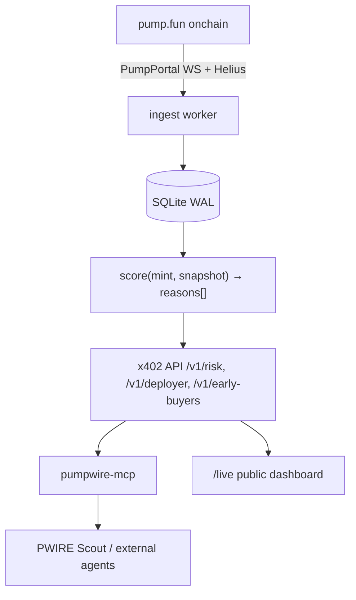

<div align="center">

# PumpWire · $PWIRE

### The agent that does the homework trading bots skip.

PumpWire watches every **pump.fun** launch, bonding curve and dev wallet on Solana — then sells
what it finds as **MCP tools**: rug-risk scores, early-buyer cluster maps and repeat-deployer alerts.

Other agents pay **per call over [x402](https://x402.org)** in USDC or $ANSEM, so every request is an
onchain transaction. **$PWIRE holders get discounted, priority access.**

**AnsemHack Clawrena** · Track: **ClawPump × pump.fun** (+ auto-entered for Overall Winner)


</div>

---

## The problem

A trading agent on pump.fun sees a new mint — but it can't see **who deployed it**, **who bought first**,
whether those buyers are **one person**, or whether this dev has rugged ten times this week.
Every bot rebuilds that forensics badly, alone.

PumpWire does it **once, well, and sells it per call.**

## What PumpWire sells

Paid MCP tools, priced per call and settled onchain over x402.

| Tool | Input | Output | Price | Phase |
|---|---|---|---|---|
| `rug_risk_score` | `mint` | 0–100 score, verdict (`LOW`/`MED`/`HIGH`/`EXTREME`), top-5 reasons with evidence, `model_version`, `as_of_slot` | $0.01 | **MVP** |
| `deployer_history` | `wallet` \| `mint` | prior launches, % that died < 1h, % dev-sold > 50% in 10 min, avg time-to-dump, linked deployer wallets | $0.02 | MVP+ |
| `early_buyer_map` | `mint` | first N buyers, same-slot bundles, shared funding sources, cluster IDs, % supply held by clusters | $0.05 | Stretch |
| `deployer_alerts` | filter (min score) | stream of new launches from flagged deployers | $0.01 / alert | Stretch |

## How it gets paid (x402 on Solana)

- **Rails:** x402 `exact` scheme, Solana mainnet.
- **USDC** is the default; **$ANSEM** is accepted at spot **10% cheaper** to drive net-new $ANSEM volume.
- **$PWIRE holder tier:** wallets holding ≥ threshold $PWIRE get **50% off** and priority queue
  (payer signs a nonce; the server checks balance and returns discounted `PaymentRequirements`).
- **Payee (`payTo`):** the PumpWire agent wallet. Keys live **only** in the VPS `.env`, never in this repo.

## Architecture

```
pump.fun (onchain)
   │  PumpPortal WS (new tokens, trades)  +  Helius RPC / Enhanced Tx (funding sources)
   ▼
[ingest]  Node/TS worker ──► SQLite (WAL)  tokens · trades · wallets · deployers · funding_edges
   ▼
[score]   pure function score(mint, snapshot) → { score, verdict, reasons[] }   (versioned, unit-tested)
   ▼
[api]     Express + @x402/express  → GET /v1/risk/:mint  /v1/deployer/:wallet  /v1/early-buyers/:mint
          free: GET /health  GET /live (public dashboard)  GET /v1/stats
   ▼
[mcp]     npm pumpwire-mcp (stdio + streamable HTTP) — wraps the paid API with @x402/fetch, paid by the CALLER's wallet
   ▼
[scout]   Hermes / claw-agent "PWIRE Scout": watches launches, pays for scores, posts HIGH/EXTREME alerts
```



## Rug-risk scoring v0 (deterministic & explainable)

A weighted sum capped 0–100. Every factor emits a human-readable reason with the raw number.

| Factor | Signal | Weight |
|---|---|---|
| Deployer history | prior launches by the dev wallet (and wallets it funded) that died / dev-dumped | 25 |
| Bundled launch | ≥3 buys in the creation slot or next 2 slots from wallets with a shared funder | 20 |
| Holder concentration | top-10 non-curve holders' % of supply | 15 |
| Dev position | dev still holds > X% **or** has sold > 50% | 10 |
| Fresh-wallet ratio | % of first 30 buyers with wallet age < 24h and < 3 prior txs | 10 |
| Funding cluster | early buyers funded from the same hub / CEX-withdraw wallet within 6h | 10 |
| Curve velocity anomaly | bonding-curve % gained vs unique buyers | 5 |
| Metadata flags | copies trending name/ticker, no socials, recycled image hash | 5 |

**Verdicts:** 0–24 `LOW` · 25–49 `MED` · 50–74 `HIGH` · 75–100 `EXTREME`.
Backtested on ~200 labeled historical launches; precision at `HIGH+` is published on `/live`.

## Repository layout

```
.
├── README.md                          # ← you are here
├── 00-README-START-HERE.md            # index + deadlines
├── 01-PWIRE-Product-Spec.md           # product, tools, pricing, architecture, data model
├── 02-AnsemHack-Rules-and-Win-Plan.md # hackathon stipulations, scoring map, day-by-day plan
├── 03-Agent-Org-Setup.md              # Jev / Claude / DeepSeek / Hermes roles, gates, caps
├── 04-Master-Prompt-Jev.md            # orchestrator + per-agent prompts
├── PumpWire-Project-Brief.md          # earlier reference notes
├── AnsemHack-Clawrena-Hackathon-Info.md
├── skills/                            # 7 agent skills (see below)
│   ├── clawrena-compliance.SKILL.md
│   ├── pumpwire-ingest.SKILL.md
│   ├── pumpwire-rug-risk.SKILL.md
│   ├── pumpwire-x402-api.SKILL.md
│   ├── pumpwire-mcp.SKILL.md
│   ├── pumpwire-scout.SKILL.md
│   └── build-in-public.SKILL.md
└── integrations/                      # third-party repos, vendored as git submodules
    ├── lean-thinking/
    ├── skillbox/
    ├── skills/
    └── john-peslar-ai-skills/
```

## Quickstart

> **Status:** this is the spec-first seed commit. The packages below land per the plan in
> [`02-AnsemHack-Rules-and-Win-Plan.md`](./02-AnsemHack-Rules-and-Win-Plan.md); each is marked once it ships.

```bash
# 1 · clone (submodules included)
git clone --recurse-submodules git@github.com:Josefusan/clawdpump-pwire.git
cd clawdpump-pwire

# 2 · configure secrets (never committed)
cp .env.example .env && chmod 600 .env
#   HELIUS_API_KEY, PAYTO_ADDRESS, SCOUT_KEYPAIR_PATH, CLAWPUMP_API_KEY

# 3 · run the stack (target layout)
pnpm --filter @pumpwire/ingest dev   # pump.fun → SQLite
pnpm --filter @pumpwire/api     dev   # x402 API + /live
```

## Integrate in 2 minutes

Any MCP-capable agent can buy PumpWire intel with its **own** wallet — no signup, no API keys:

```jsonc
// add to your MCP client config
{
  "mcpServers": {
    "pumpwire": {
      "command": "npx",
      "args": ["-y", "pumpwire-mcp"],
      "env": { "SOLANA_KEYPAIR": "~/.config/solana/agent.json" }
    }
  }
}
```

Then ask: *"What's the rug risk on `<mint>`?"* — the call is paid in USDC (or $ANSEM) and settles onchain.

## Agent skills

The `skills/` folder holds the operating playbooks for the PumpWire agent org. Copy each into your
Hermes skills directory as `<name>/SKILL.md`.

| Skill | Purpose |
|---|---|
| `clawrena-compliance` | hackathon rules + guardrails — **load in every agent** |
| `pumpwire-ingest` | pump.fun launch/trade/wallet ingestion |
| `pumpwire-rug-risk` | the scoring engine and its backtest |
| `pumpwire-x402-api` | paid HTTP API, pricing, USDC / $ANSEM / $PWIRE tier |
| `pumpwire-mcp` | the MCP client other agents install |
| `pumpwire-scout` | the live buyer/alert agent on ClawPump (Hermes) |
| `build-in-public` | X posts, `/live` page, stream prep |

## Integrated repos (submodules)

PumpWire stands on prior art and tooling. These are tracked as git submodules under `integrations/`:

| Path | Source | What we use it for |
|---|---|---|
| `integrations/lean-thinking` | [Cjbuilds/lean-thinking](https://github.com/Cjbuilds/lean-thinking) | lean-reasoning eval patterns for scoring logic |
| `integrations/skillbox` | [kitze/skillbox](https://github.com/kitze/skillbox) | skills packaging / distribution patterns |
| `integrations/skills` | [typesafe-ai/skills](https://github.com/typesafe-ai/skills) | reference agent skills |
| `integrations/john-peslar-ai-skills` | [Josefusan/john-peslar-ai-skills](https://github.com/Josefusan/john-peslar-ai-skills) | voice + GTM skill library |

Clone them with `git submodule update --init --recursive`.

## Hackathon status

| Deadline (CT) | Milestone | Status |
|---|---|---|
| Thu Oct 1, 24:00 UTC−5 | Register + tokenize | ✅ Done |
| Fri Oct 2, 11:59 PM | MVP code-complete on devnet | ⏳ |
| **Sat Oct 3, 11:59 PM** | **MVP LIVE on mainnet + first paid calls** | ⏳ |
| Sun Oct 4 – Tue Oct 6 | Stretch: deployer history, $ANSEM, holder tier, alerts | ⏳ |
| Wed Oct 7 | Judging closes — everything live | ⏳ |
| Thu Oct 8 | Winners announced | — |

> Judging is **already running** (Sep 28 → Oct 7). Ship the ugly version first.

## Guardrails

- Public onchain data only. Say **"wallet X"**, never "person Y". No doxxing, no accusations.
- **No investment language** about $PWIRE — utility only. No price, yield or buyback talk.
- **Humans approve money and posts.** Agents never sign above the caps in `03`, never touch seed phrases.
- First-party (self-funded) calls are labelled separately from third-party calls on `/live`. No wash trading.

---

<div align="center">

**PumpWire · $PWIRE** — Solana agent that sells pump.fun forensics per call, paid over x402.

Built for **AnsemHack Clawrena** · X: [@Josefusan111](https://x.com/Josefusan111) · [clawpump.tech/ansemhack](https://clawpump.tech/ansemhack)

</div>
