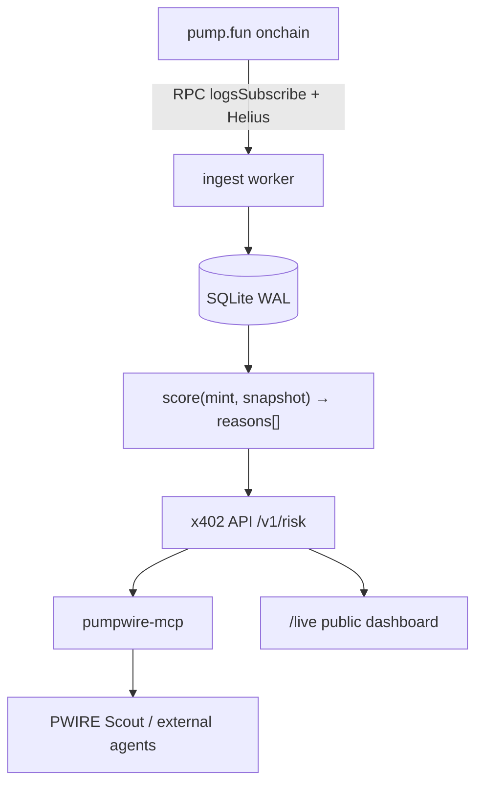

<div align="center">

# PumpWire · $PWIRE

### The agent that does the homework trading bots skip.

PumpWire watches every **pump.fun** launch, bonding curve and dev wallet on Solana — then sells
what it finds as **MCP tools**: rug-risk scores today; early-buyer cluster maps and repeat-deployer alerts are planned.

Other agents pay **per call over [x402](https://x402.org)** in USDC, so every request is an onchain
transaction. **$PWIRE holder tier is live:** a wallet holding ≥ 1,000,000 $PWIRE pays half. $ANSEM payment is planned.

**AnsemHack Clawrena** · Track: **ClawPump × pump.fun** (+ auto-entered for Overall Winner)


</div>

---

## Use it in 5 minutes

**Judges:** start with [docs/SUBMISSION.md](./docs/SUBMISSION.md).

- **Hermes / claw-agent:** [`hermes/`](./hermes/README.md) — register the MCP server, drop in the skill, ask *"rug check `<mint>`"*.
- **Any MCP client (Claude Code, Claude Desktop, Cursor):** the config block is in [`docs/USE-CASES.md`](./docs/USE-CASES.md#b-claude-code--claude-desktop-mcp-config--sample-prompt).
- **Any language over HTTP:** `GET /v1/risk/:mint` → `402` with the price → pay → `200`. Runnable: [`examples/x402-fetch.mjs`](./examples/README.md).
- **Proof it is being used:** `GET /v1/stats` and the `/live` page split first-party calls (ours) from third-party calls (yours).

The MCP package is `@pumpwire/mcp` (private, not on npm): clone, `npm ci`, `npm run build -w @pumpwire/mcp`, entry
point `packages/mcp/dist/index.js`. The API runs on **Solana mainnet** (live since 2026-10-01; first paid calls in [docs/SUBMISSION.md](docs/SUBMISSION.md)).
Every call is risk information, not advice.

## The problem

A trading agent on pump.fun sees a new mint — but it can't see **who deployed it**, **who bought first**,
whether those buyers are **one person**, or whether this dev has rugged ten times this week.
Every bot rebuilds that forensics badly, alone.

PumpWire does it **once, well, and sells it per call.**

## What PumpWire sells

Paid MCP tools, priced per call and settled onchain over x402.

| Tool | Input | Output | Price | Phase |
|---|---|---|---|---|
| `rug_risk_score` | `mint` | 0–100 score, verdict (`LOW`/`MED`/`HIGH`/`EXTREME`), top-5 reasons with evidence, `model_version`, `as_of_slot` | $0.01 | **MVP** |
| `deployer_history` | `wallet` \| `mint` | prior launches, % that died < 1h, % dev-sold > 50% in 10 min, avg time-to-dump, linked deployer wallets | $0.02 | MVP+ |
| `early_buyer_map` | `mint` | first N buyers, same-slot bundles, shared funding sources, cluster IDs, % supply held by clusters | $0.05 | Stretch |
| `deployer_alerts` | filter (min score) | stream of new launches from flagged deployers | $0.01 / alert | Stretch |

## How it gets paid (x402 on Solana)

- **Rails:** x402 `exact` scheme on Solana (mainnet live; devnet for testing). $0.01 USDC per `rug_risk_score` call.
- **USDC** is the only accepted asset today. **Planned:** $ANSEM at a 10% discount.
- **$PWIRE holder tier (live since 2026-10-04):** wallets holding ≥ 1,000,000 $PWIRE pay $0.005 instead of $0.01 ([docs/HOLDER-TIER.md](docs/HOLDER-TIER.md)). Send
  `X-PWIRE-HOLDER: <wallet>` and pay from that wallet; `@pumpwire/mcp` does this automatically. The discount is bound to
  that wallet (memo + payer check), so it cannot be borrowed by another wallet.
- **Payee (`payTo`):** the PumpWire agent wallet. Keys live **only** in the VPS `.env`, never in this repo.

## Architecture

```
pump.fun (onchain)
   │  Solana RPC logsSubscribe (pump.fun events: creates, trades, migrations)  +  Helius Enhanced Tx (funding sources)
   ▼
[ingest]  Node/TS worker ──► SQLite (WAL)  tokens · trades · wallets · deployers · funding_edges
   ▼
[score]   pure function score(mint, snapshot) → { score, verdict, reasons[] }   (versioned, unit-tested)
   ▼
[api]     Express + @x402/core  → GET /v1/risk/:mint
          free: GET /health  GET /live (public dashboard)  GET /v1/stats
   ▼
[mcp]     @pumpwire/mcp (private; run from packages/mcp/dist/index.js, stdio) — wraps the paid API with @x402/fetch, paid by the CALLER's wallet
   ▼
[scout]   "PWIRE Scout" (our own buyer, a Node worker): watches launches, pays for scores, drafts HIGH/EXTREME alerts for approval (never posts)
```



## Rug-risk scoring v0 (deterministic & explainable)

A weighted sum capped 0–100. Every factor emits a human-readable reason with the raw number.

| Factor | Signal | Weight |
|---|---|---|
| Deployer history | prior launches by the dev wallet (and wallets it funded) that died / dev-dumped | 25 |
| Bundled launch | ≥3 buys in the creation slot or next 2 slots from wallets with a shared funder | 20 |
| Holder concentration | top-10 non-curve holders' % of supply | 15 |
| Dev position | dev still holds > X% **or** has sold > 50% | 10 |
| Fresh-wallet ratio | % of first 30 buyers with wallet age < 24h and < 3 prior txs | 10 |
| Funding cluster | early buyers funded from the same hub / CEX-withdraw wallet within 6h | 10 |
| Curve velocity anomaly | bonding-curve % gained vs unique buyers | 5 |
| Metadata flags | copies trending name/ticker, no socials, recycled image hash | 5 |

**Verdicts:** 0–24 `LOW` · 25–49 `MED` · 50–74 `HIGH` · 75–100 `EXTREME`.
A backtest harness exists (`scripts/backtest.mjs`, labels DEAD_1H / DEV_DUMP / SURVIVED_24H mechanically), but the labelled sample is still small, so no accuracy figure is quoted yet. Precision and recall at `HIGH+` appear on `/live` with the sample size once it is meaningful.

## Repository layout

```
.
├── README.md                          # ← you are here
├── docs/
│   ├── kit/                           # planning kit (spec, rules, org setup, prompts)
│   │   ├── 00-README-START-HERE.md            # index + deadlines
│   │   ├── 01-PWIRE-Product-Spec.md           # product, tools, pricing, architecture, data model
│   │   ├── 02-AnsemHack-Rules-and-Win-Plan.md # hackathon stipulations, scoring map, day-by-day plan
│   │   ├── 03-Agent-Org-Setup.md              # Jev / Claude / DeepSeek / Hermes roles, gates, caps
│   │   ├── 04-Master-Prompt-Jev.md            # orchestrator + per-agent prompts
│   │   ├── PumpWire-Project-Brief.md          # earlier reference notes
│   │   └── AnsemHack-Clawrena-Hackathon-Info.md
│   └── adr/                           # architecture decision records
├── packages/                          # ingest, score, api, mcp, live, scout
├── skills/                            # 8 agent skills (see below)
│   ├── clawrena-compliance.SKILL.md
│   ├── pumpwire-ingest.SKILL.md
│   ├── pumpwire-rug-risk.SKILL.md
│   ├── pumpwire-x402-api.SKILL.md
│   ├── pumpwire-mcp.SKILL.md
│   ├── pumpwire-scout.SKILL.md
│   ├── build-in-public.SKILL.md
│   └── simplified-technical-english.SKILL.md   # wraps the integrations/ submodule
└── integrations/                      # third-party repos, tracked as git submodules
    ├── lean-thinking/
    ├── skillbox/
    ├── skills/
    ├── john-peslar-ai-skills/
    └── simplified-technical-english/
```

## Quickstart

```bash
# 1 · clone and build (Node 22; npm workspaces)
git clone https://github.com/Josefusan/clawdpump-pwire.git && cd clawdpump-pwire
npm ci && npm run build --workspaces --if-present
npm test                             # vitest across all packages

# 2 · secrets live OUTSIDE the repo (see env.example for the NAMES only)
#    ~/.config/pumpwire/devnet.env, chmod 600

# 3 · run the stack
node --experimental-sqlite --env-file=$HOME/.config/pumpwire/devnet.env packages/ingest/dist/main.js   # pump.fun → SQLite
node --experimental-sqlite --env-file=$HOME/.config/pumpwire/devnet.env packages/api/dist/index.js     # x402 API + /live
# devnet via pm2: pm2 start ecosystem.devnet.config.cjs  (ingest, api, scout); production runs the mainnet ecosystem config, see docs/RUNBOOK.md
```

## Integrate in 2 minutes

Any MCP-capable agent can buy PumpWire intel with its **own** wallet — no signup, no API keys:

```jsonc
// add to your MCP client config (absolute paths; the server reads only the env you list)
{
  "mcpServers": {
    "pumpwire": {
      "command": "node",
      "args": ["/ABSOLUTE/PATH/TO/clawdpump-pwire/packages/mcp/dist/index.js"],
      "env": {
        "PUMPWIRE_API_URL": "https://vision-involved-clips-winner.trycloudflare.com",
        "SOLANA_KEYPAIR_PATH": "/ABSOLUTE/PATH/TO/agent-wallet.json",
        "PUMPWIRE_NETWORK": "mainnet",
        "PUMPWIRE_MAX_PRICE_USD": "0.05",
        "PUMPWIRE_DAILY_CAP_USD": "1"
      }
    }
  }
}
```

Then ask: *"What's the rug risk on `<mint>`?"* — the call is paid in USDC from the agent's own wallet and settles
onchain. Caps are enforced before anything is signed. Full walkthroughs: [`docs/USE-CASES.md`](./docs/USE-CASES.md).

## Agent skills

The `skills/` folder holds the operating playbooks for the PumpWire agent org, one flat
`<name>.SKILL.md` file each. To use one in Hermes, copy it in as
`~/.hermes/skills/<category>/<name>/SKILL.md` (see [`hermes/README.md`](./hermes/README.md)).

| Skill | Purpose |
|---|---|
| `clawrena-compliance` | hackathon rules + guardrails — **load in every agent** |
| `pumpwire-ingest` | pump.fun launch/trade/wallet ingestion |
| `pumpwire-rug-risk` | the scoring engine and its backtest |
| `pumpwire-x402-api` | paid HTTP API, pricing, USDC + $PWIRE holder tier (live); $ANSEM planned |
| `pumpwire-mcp` | the MCP client other agents install (private; run from packages/mcp/dist/index.js) |
| `pumpwire-scout` | our own buyer/alert agent on ClawPump: pays for scores, drafts alerts |
| `build-in-public` | X posts, `/live` page, stream prep |
| `simplified-technical-english` | third-party (submodule): rewrite docs in ASD-STE100 Simplified Technical English |

## Integrated repos (submodules)

PumpWire stands on prior art and tooling. These are tracked as git submodules under `integrations/`:

| Path | Source | What we use it for |
|---|---|---|
| `integrations/lean-thinking` | [Cjbuilds/lean-thinking](https://github.com/Cjbuilds/lean-thinking) | lean-reasoning eval patterns for scoring logic |
| `integrations/skillbox` | [kitze/skillbox](https://github.com/kitze/skillbox) | skills packaging / distribution patterns |
| `integrations/skills` | [typesafe-ai/skills](https://github.com/typesafe-ai/skills) | reference agent skills |
| `integrations/john-peslar-ai-skills` | [Josefusan/john-peslar-ai-skills](https://github.com/Josefusan/john-peslar-ai-skills) | voice + GTM skill library |
| `integrations/simplified-technical-english` | [0xpili/simplified-technical-english](https://github.com/0xpili/simplified-technical-english) | STE (ASD-STE100) writing rules + a check tool for docs |

Clone them with `git submodule update --init --recursive`.

## Hackathon status

| Deadline (CT) | Milestone | Status |
|---|---|---|
| Thu Oct 1, 24:00 UTC−5 | Register + tokenize | ✅ Done |
| Thu Oct 1 | MVP code-complete on devnet (ingest, scorer, x402 API, MCP, Scout, /live) | ✅ Done |
| **Sat Oct 3, 11:59 PM CT** | **MVP LIVE on mainnet + first paid calls** | ✅ (Oct 1) |
| Sun Oct 4 | $PWIRE holder tier live on mainnet (≥ 1M PWIRE → 50% off) | ✅ |
| Mon Oct 5 – Tue Oct 6 | Stretch: deployer history, $ANSEM payments, alerts | ⏳ |
| Wed Oct 7 | Judging closes — everything live | ⏳ |
| Thu Oct 8 | Winners announced | — |

> Judging is **already running** (Sep 28 → Oct 7). Ship the ugly version first.

## Guardrails

- Public onchain data only. Say **"wallet X"**, never "person Y". No doxxing, no accusations.
- **No investment language** about $PWIRE — utility only. No price, yield or buyback talk.
- **Humans approve money and posts.** Agents never sign above the caps in `03`, never touch seed phrases.
- First-party (self-funded) calls are labelled separately from third-party calls on `/live`. No wash trading.

---

<div align="center">

**PumpWire · $PWIRE** — Solana agent that sells pump.fun forensics per call, paid over x402.

Built for **AnsemHack Clawrena** · X: [@Josefusan111](https://x.com/Josefusan111) · [clawpump.tech/ansemhack](https://clawpump.tech/ansemhack)

</div>
